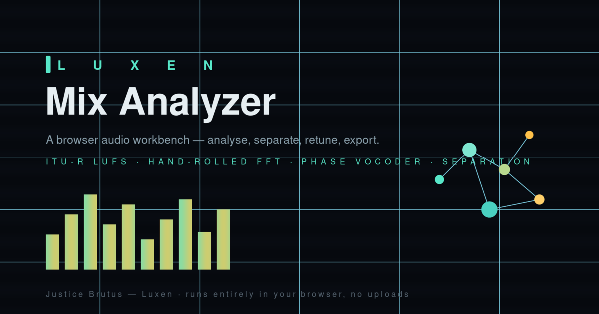

<div align="center">



# Luxen Mix Analyzer

**A browser audio workbench — analyse, separate, retune, and export a mix, entirely on the client. Zero dependencies. No uploads.**

[**▶ Live demo**](https://luxen-mix-analyzer.vercel.app) &nbsp;·&nbsp; [Run it locally](#run-it-locally)

</div>

---

## What it is

Drop in a track and the app measures it, visualises it, pulls it apart, and lets you retune and re-export it — all in the browser, with **no libraries and no server**. Every number on screen comes from DSP written by hand: the FFT, the loudness metering, the pitch shifting, and the source separation are all implemented from scratch in plain JavaScript.

The demo track is **"On a Fence," written, produced, and performed by Justice Brutus (Luxen).**

## Features

- **Mix quality scorecard** — integrated loudness in **LUFS to the ITU-R BS.1770-4 K-weighted, gated standard**, plus spectral centroid, RMS, crest factor, and a plain-language read on each.
- **Live frequency spectrum** — a real-time FFT display driven by a hand-rolled radix-2 Cooley–Tukey transform (no Web Audio `AnalyserNode` shortcut for the analysis math).
- **EQ sweetener** — a filter chain with musical presets (Warm + bright, Air lift, Radio low-end, Smile) for quick post-mix polish.
- **Frequency & tuning** — detects the dominant frequency live and shifts pitch by semitones or snaps to a tuning standard (432 / 440 / 444 / 528 Hz). Two engines: instant tape-style *speed* mode and a tempo-preserving *phase-vocoder* mode.
- **Vocal / instrumental separation** — splits a track into vocal and instrumental stems using spectral center-channel extraction (a per-bin L/R balance mask, gated to the vocal band), with solo/mute, level meters, and per-stem WAV export.
- **Spatial track map (Luxen Field)** — plots the song as a field of points by spectral centroid and energy; click any point to seek to that moment.
- **Export** — render the current EQ + tuning settings offline and download a 16-bit PCM WAV (encoder written by hand).

## The engineering, plainly

The point of this project is that the hard parts aren't imported — they're built:

| Piece | Implementation |
| --- | --- |
| FFT | Hand-written radix-2 Cooley–Tukey, no DSP library |
| Loudness | ITU-R BS.1770-4 K-weighting + gating, computed from scratch |
| Pitch shift | Phase vocoder (tempo-preserving) + `playbackRate` speed mode |
| Separation | STFT + per-bin L/R balance mask, vocal-band gated |
| WAV export | Hand-rolled 16-bit PCM encoder |
| Dependencies | **None.** Plain HTML/CSS/JS — no build step |

Because there's no build step, the whole app runs by opening one file.

## Run it locally

The app opens directly, but the "Load demo track" button and the separation feature read local assets, which browsers restrict on the `file://` protocol. For the full experience, serve the folder over HTTP:

```bash
# from the project folder
python -m http.server 8000
# then open http://localhost:8000
```

Any static server works. Opening `index.html` directly still runs everything except the auto-loaded demo (which falls back to a synthesised tone).

## Design & accessibility

The interface is a deliberate "lab instrument" system — IBM Plex Mono for data, Space Grotesk for chrome, a cyan-tinted dark field, and a slow ambient hue cycle. It holds to a real accessibility floor: WCAG AA contrast verified across the full animated color range, keyboard-operable controls with visible focus states, ARIA labels on the interactive canvas, and `prefers-reduced-motion` support that freezes the animation. See [`DESIGN-SYSTEM.md`](DESIGN-SYSTEM.md).

## Tech

Vanilla JavaScript, the Web Audio API (`AudioContext` / `OfflineAudioContext`), and Canvas 2D. No framework, no bundler, no runtime dependencies.

## License

Source code is released under the [MIT License](LICENSE).

**The demo audio ("On a Fence") is © Justice Brutus and is *not* covered by the MIT license** — it's included for demonstration only. All rights reserved.
